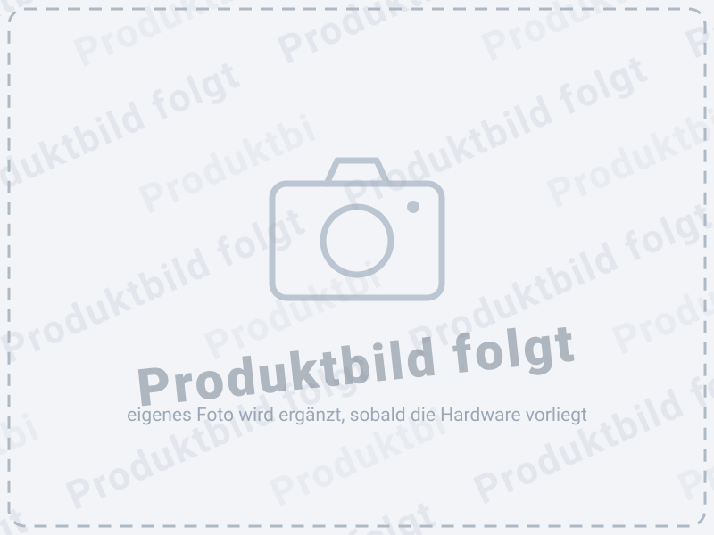

# Einkaufsführer Zubehör (Phase M12)

Anforderung (29.07.2026): Die Dokumentation bekommt **Beispiellinks und
Bilder** für die zu bestellende Zubehör-Hardware — als eigenes Kapitel im
Root-README **und** im Handbuch.

## Umfang

| Position | Zweck im Projekt |
| --- | --- |
| **SSD-Wechselrahmen** | Boot-SSD der Pis (SD nur Notbehelf), wartungsfreundlich im Datenschrank |
| **OLED-Display** | Statusanzeige an J5 (I²C, Phase M11) |
| **WS2812B** | Status-LED an J7 (Phase M11) |
| **Keystone-Module** | saubere Durchführungen im Datenschrank (RJ45/USB) |
| **SATA-Adapter** | SSD-an-USB-Anbindung des Pi 4 |
| **USB-Verbindungskabel** | Verkabelung Pi ↔ SSD/Peripherie |

Je Position: kurze Anforderungsbeschreibung (worauf es technisch ankommt),
1–2 **Beispiellinks** (Amazon/Reichelt — als Beispiele gekennzeichnet, keine
Affiliate-Links), Bild, ggf. „Finger weg von"-Hinweise (wie bei der
LED-Farben-Erkenntnis in der Reichelt-Liste).

## Wichtig bei den Bildern

Das Repo ist **öffentlich**: Produktfotos aus Shops sind urheberrechtlich
geschützt und dürfen nicht übernommen werden. Deshalb **eigene Fotos** der
tatsächlich gekauften Teile (liefert der User, sobald die Hardware da ist)
— das ist ohnehin glaubwürdiger („so sieht das Richtige aus").

Bis dahin wird überall der **Platzhalter** verwendet:

- Vektor (skaliert, bevorzugt): [`img/produktbild-platzhalter.svg`](img/produktbild-platzhalter.svg)
- Raster (800 × 600, falls SVG nicht geht): [`img/produktbild-platzhalter.png`](img/produktbild-platzhalter.png)

## Umsetzung

1. Kapitel **„Zubehör bestellen"** im Root-README (kompakte Tabelle mit Links)
2. Eigenes **Handbuch-Kapitel** (ausführlich, bebildert, mit
   Anforderungsbeschreibungen und Einbauhinweisen — Stil der bestehenden
   Kapitel), PDF neu bauen
3. Beispiellinks vom User verifizieren lassen (Verfügbarkeit/Varianten),
   analog zur Reichelt-Bestellliste

## Einordnung

Phase **M12** (reine Doku-Phase, jederzeit einschiebbar; Bilder abhängig von
der gelieferten Hardware). Akzeptanz: Kapitel in README und Handbuch-PDF,
alle sechs Positionen mit Anforderung + Beispiellink, Bilder der realen
Teile, keine fremden Produktfotos.
